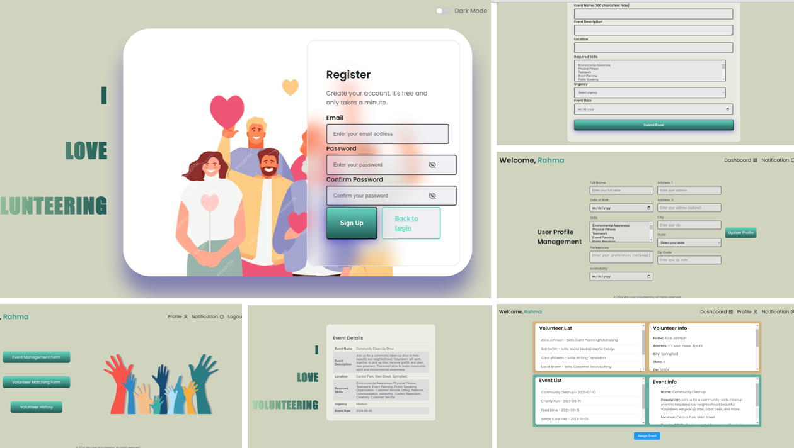

# Volunteer Match
Volunteer Match is a comprehensive web application designed to manage volunteers and events efficiently. Built using Flask for the backend, PostgreSQL for the database, and HTML/CSS/JavaScript for the frontend, Volunteer Match offers robust features to streamline volunteer management.


<div align="center">
  
  
</div>


## Table of Contents

- [Features](#features)
- [Tech Stack](#tech-stack)
- [Setup Instructions](#setup-instructions)
  - [Prerequisites](#prerequisites)
  - [Installation](#installation)
  - [Database Setup](#database-setup)
    - [For macOS](#for-macos)
    - [For Windows](#for-windows)
- [Running the Application](#running-the-application)
- [Testing](#testing)
- [Endpoints](#endpoints)
  - [User Authentication](#user-authentication)
  - [User Profile](#user-profile)
  - [Event Management](#event-management)
  - [Volunteer Management](#volunteer-management)
  - [Volunteer History](#volunteer-history)
- [Images](#images)

## Features

- User authentication
- User profile management
- Event management
- Volunteer matching
- Notification system
- Volunteer history tracking

## Tech Stack

- **Backend:** Flask with Python
- **Frontend:** HTML, CSS, JavaScript
- **Database:** PostgreSQL

## Setup Instructions

### Prerequisites

- Python 3.9+
- PostgreSQL

### Installation

1. **Clone the repository:**

    ```bash
    git clone https://github.com/ayyan67/VolunteerMatch.git
    cd VolunteerMatch
    ```

2. **Create and activate a virtual environment:**

    ```bash
    python3 -m venv venv
    source venv/bin/activate  # For Windows use `.\venv\Scripts\activate`
    ```

3. **Install dependencies:**

    ```bash
    pip install -r requirements.txt
    ```

### Database Setup

#### For macOS

##### The following instructions assume that your macOS system has homebrew installed, the instructions for which can be found [here](https://brew.sh/).

1. **Install PostgreSQL:**

    ```bash
    brew install postgresql
    ```

2. **Start PostgreSQL service:**

    ```bash
    brew services start postgresql
    ```

3. **Create the database and role:**

    ```bash
    psql postgres
    ```

    ```sql
    CREATE ROLE postgres WITH LOGIN SUPERUSER PASSWORD 'arti';
    CREATE DATABASE volunteers_db;
    ```
    Note: For our application, we used the password given above.

4. **Connect to the database:**

    ```sql
    \c volunteers_db
    ```

5. **Run the database script:**

    ```bash
    psql -U postgres -d volunteers_db -f path_to_your_db_script.sql
    ```

#### For Windows

1. **Install PostgreSQL:**

    Download and install PostgreSQL from [here](https://www.postgresql.org/download/windows/).

2. **Start PostgreSQL service:**

    Use the pgAdmin tool or Command Prompt to start the PostgreSQL service.

3. **Create the database and role:**

    Open Command Prompt and run:

    ```bash
    psql -U postgres
    ```

    ```sql
    CREATE ROLE postgres WITH LOGIN SUPERUSER PASSWORD 'arti';
    CREATE DATABASE volunteers_db;
    ```
    Note: For our application, we used the password given above.

4. **Connect to the database:**

    ```sql
    \c volunteers_db
    ```

5. **Run the database script:**

    ```bash
    psql -U postgres -d volunteers_db -f path_to_your_db_script.sql
    ```

## Running the Application

1. **Set the Flask app environment variable:**

    ```bash
    export FLASK_APP=run.py  # For Windows use `set FLASK_APP=run.py`
    export FLASK_ENV=development  # For Windows use `set FLASK_ENV=development`
    ```

2. **Run the Flask application:**

    ```bash
    flask run
    ```

3. **Access the application:**

    Open your browser and navigate to `http://127.0.0.1:5000`. Note: The default localhost port used is 5000.

## Testing

To run the tests using pytest and generate a coverage report:

1. **Install pytest and coverage:**

    ```bash
    pip install pytest coverage
    ```

2. **Run the tests and generate the coverage report:**

    ```bash
    coverage run -m pytest
    coverage report
    coverage html  # To generate an HTML report
    ```

## Endpoints

### User Authentication

- **POST /login**
  - Authenticate user and start session
  - Request: `{ email, password }`
  - Response: `{ message: 'Login successful' }` or `{ message: 'Invalid email or password' }`

- **POST /reset**
  - Reset user password
  - Request: `{ email, newPassword, confirmNewPassword }`
  - Response: `{ message: 'Password reset successfully' }` or appropriate error message

### User Profile

- **POST /api/updateProfile**
  - Update user profile details
  - Request: `{ email, fullName, dob, address1, address2, city, state, zip, skills, preferences, availability }`
  - Response: `{ message: 'Profile updated successfully' }`

### Event Management

- **GET /matching/api/events**
  - Retrieve all events
  - Response: `[{ id, name, description, location, required_skills, urgency, date }]`

- **POST /matching/api/assign_event**
  - Assign a volunteer to an event
  - Request: `{ volunteer_name, event_name }`
  - Response: `{ message: 'Event assigned to volunteer' }` or appropriate error message

### Volunteer Management

- **GET /matching/api/volunteers**
  - Retrieve all volunteers
  - Response: `[{ name, address1, address2, city, state, zip, skills, preferences, availability, email, phone, assigned_event, history }]`

### Volunteer History

- **GET /history/api/volunteer_history**
  - Retrieve volunteer history
  - Response: `[{ volunteer_name, event_name, status, date }]`

Thank you for using Volunteer Match! If you have any questions or encounter any issues, please refer to our documentation or contact support.
